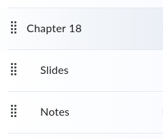
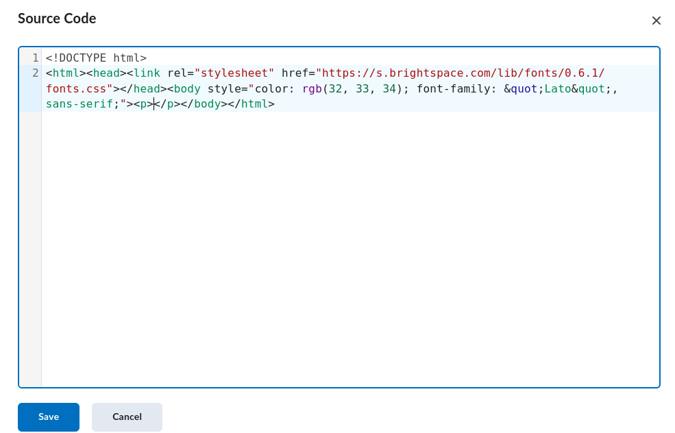
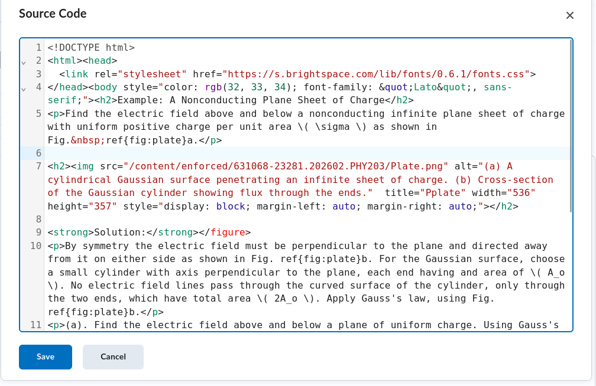
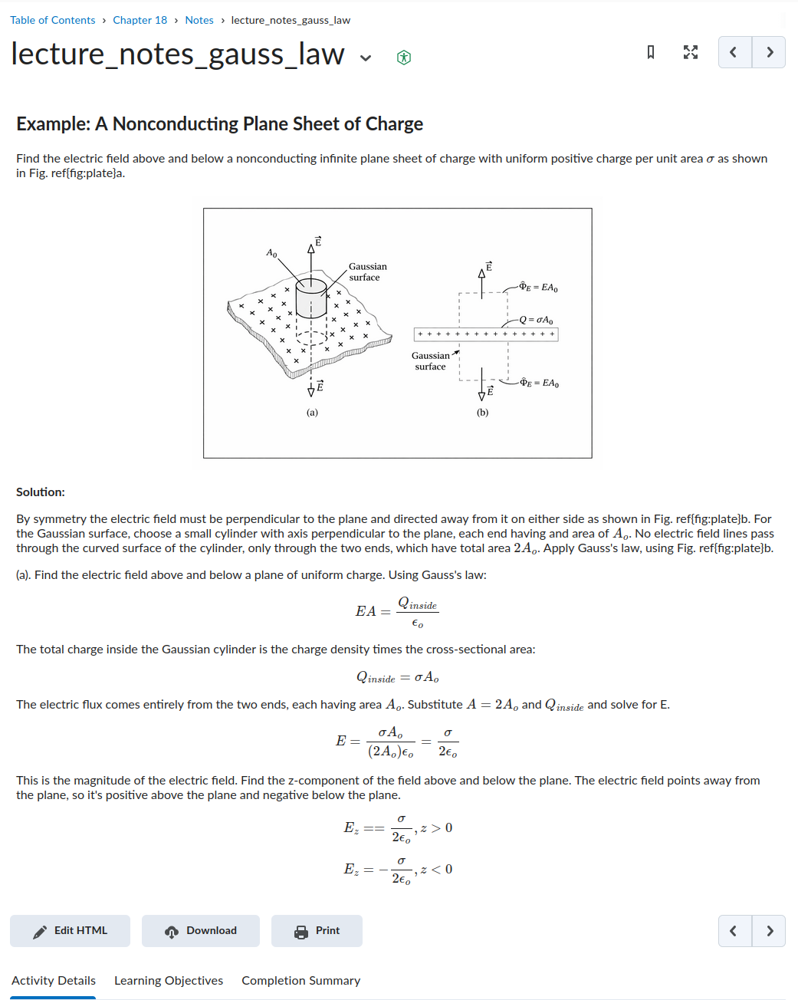
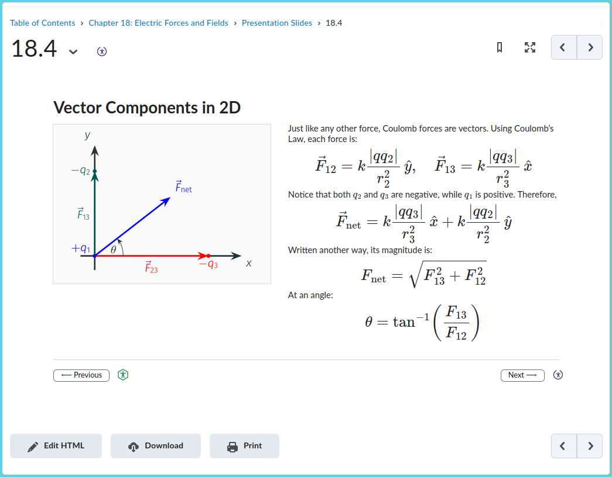

+++
title = 'Publishing Latex to D2L'
draft = false
+++
## Introduction

<div class ="lead">

LaTeX remains the standard authoring system for mathematics, physics, and much of STEM. It is precise, expressive, and deeply integrated into research workflows. However, modern learning management systems (LMS) such as D2L do not natively support LaTeX documents. The typical workaround is to upload a compiled PDF. While convenient, this approach is often insufficient: PDFs can present accessibility challenges, do not integrate cleanly with screen readers, and separate instructional content from the structure of the LMS itself.

Rewriting LaTeX material manually in HTML is unrealistic for anyone who maintains structured lecture notes or Beamer slides in a version-controlled repository. The goal, therefore, is not to abandon LaTeX, but to preserve it as the source of truth while publishing structured, accessible HTML inside the LMS.

This post outlines a reproducible workflow for converting LaTeX lecture notes and Beamer slides into HTML pages suitable for D2L. The method preserves mathematical notation using MathJax, maintains figure filenames and directory structure, and separates formatting concerns between lecture notes and projector-ready slides. The workflow is intentionally simple and can be extended or automated.
</div>

Here is a clean, professional version of **Step 1** for the manual workflow post:

---

## Step 1 — Create a Structured Content Area in D2L

Before converting any LaTeX content, establish a predictable folder structure inside D2L. This prevents broken links, keeps figure paths stable, and makes the workflow repeatable.

Navigate to:

**Content → Manage Files**

Within the appropriate course module (e.g., *Ch18*), create three folders:

```
Ch18/
  Slides/
  Notes/
```

Each folder has a specific purpose:

* **Slides** — HTML pages generated from Beamer frames.
* **Notes** — HTML pages generated from lecture notes.


All figures should be uploaded to D2L.

At this stage, no HTML has been written and no LaTeX has been converted. The goal is simply to establish a clean, predictable structure that supports the rest of the workflow.




## Step 3 — Create a Lecture Notes Page and Extract the Default HTML

With the folder structure and figures in place, the next step is to create a content page that will hold the converted lecture notes.

Navigate to:

**Content → (Your Module, e.g., Ch18) → Notes → Create a File**

D2L will open a visual editor by default. Switch to **HTML Source** view. In most D2L installations, this is accessible through the editor toolbar (often labeled “HTML Source” or represented by a `<>` icon).

When you switch to HTML Source, D2L automatically generates a default HTML skeleton. It will look similar to:

```html
<!DOCTYPE html>
<html>
<head>
  <link rel="stylesheet" href="https://s.brightspace.com/lib/fonts/...">
</head>
<body>
</body>
</html>
```

Copy this entire HTML snippet.

This default structure matters because:

* It includes D2L’s styling and font references.
* It ensures compatibility with the LMS environment.
* It prevents layout inconsistencies.

Do not delete or replace this skeleton blindly. Instead, it will be used as the outer container for the converted LaTeX content.

At this stage:

* You have created a Notes page.
* You have accessed the HTML source.
* You have copied the default D2L HTML structure.

No LaTeX has been converted yet.

The next step is to move to ChatGPT and use this skeleton as the base into which the LaTeX content will be transformed.




Here is the corrected and simplified version of Step 4, aligned with how D2L actually behaves.

---

## Step 4 — Convert a LaTeX Lecture Snippet Using ChatGPT

With the default D2L HTML skeleton copied, the next step is to transform a LaTeX snippet into structured HTML that fits inside that skeleton.

Open ChatGPT in a separate window.

Begin by pasting the default D2L HTML skeleton and give it context:

```
The following HTML is the default HTML created by D2L when a new content page is created.
Preserve its structure and do not remove required elements.

[PASTE DEFAULT D2L HTML HERE]
```

Then continue the prompt:

```
Below is a LaTeX lecture snippet.

Convert it into clean HTML suitable for lecture notes inside D2L.

Requirements:
- Do not add or remove content.
- Preserve all mathematical notation using MathJax syntax (\( \) and \[ \]).
- Preserve figure filenames exactly.
- Do not assume relative paths.
- Use the following image path prefix exactly as written:

/content/enforced/COURSE-ID/

- Append the filename exactly as written in the LaTeX source.
- Format for readability on screen and for printing (not projection).
- Do not introduce custom JavaScript.
```

Before running this the first time, insert one image manually in D2L using the **Insert Image** tool. Then switch to HTML Source view and copy the exact path D2L generated. Replace `/content/enforced/COURSE-ID/` above with that exact prefix.

This ensures ChatGPT generates image paths that D2L will actually serve.

Now paste the LaTeX snippet beneath that instruction.

For example:

```latex
\subsection{Example: A Nonconducting Plane Sheet of Charge}
Find the electric field above and below a nonconducting infinite plane sheet of charge with uniform positive charge per unit area \(\sigma\) as shown in Fig.~\ref{fig:plate}a.

\begin{figure}[htbp]
    \centering
    \includegraphics[width=0.75\linewidth]{Plate.png}  
    \label{fig:plate}
    \caption{(a). A cylindrical Gaussian surface penetrating an infinite sheet of charge. (b). A cross-section of the same Gaussian cylinder. The flux through each end of the Gaussian surface is \(EA_o\). There is no flux through the sides of the cylindrical surface.}
\end{figure}

By symmetry the electric field must be perpendicular to the plane and directed away from it on either side as shown in Fig.~\ref{fig:plate}b. For the Gaussian surface, choose a small cylinder with axis perpendicular to the plane, each end having and area of \(A_o\). No electric field lines pass through the curved surface of the cylinder, only through the two ends, which have total area \(2A_o\). Apply Gauss's law, using Fig.~\ref{fig:plate}b.

(a). Find the electric field above and below a plane of uniform charge.  Using Gauss's law:
\[
EA = \frac{Q_{inside}}{\epsilon_o}
\]
The total charge inside the Gaussian cylinder is the charge density times the cross-sectional area:
\[
Q_{inside}=\sigma A_o
\]
The electric flux comes entirely from the two ends, each having area \(A_o\).  Substitute \(A=2A_o\) and \(Q_{inside}\) and solve for E.
\[
E=\frac{\sigma A_o}{(2A_o)\epsilon_o}= \frac{\sigma}{2\epsilon_o}
\]
This is the magnitude of the electric field. Find the z-component of the field above and below the plane. The electric field points away from the plane, so it's positive above the plane and negative below the plane.
\[
E_z = = \frac{\sigma}{2\epsilon_o}, z>0
\]
\[
E_z = - \frac{\sigma}{2\epsilon_o}, z<0
\]
```

Submit the prompt.

ChatGPT will return an HTML page that:

* Preserves the outer D2L structure.
* Keeps mathematical expressions in MathJax-compatible form.
* Inserts figures using the exact D2L path format.

Copy the generated HTML.

Return to D2L:

* Switch back to HTML Source view.
* Replace the contents of the `<body>` section with the converted content (or paste the full returned HTML if you instructed ChatGPT to preserve the skeleton).
* Save the page.



The lecture notes should now render directly inside D2L with:

* Proper mathematical formatting via MathJax.
* Images loading correctly using D2L’s canonical path format.
* Clean structure suitable for reading and printing.

This approach avoids relying on relative paths, which D2L may rewrite unpredictably.




### Aside: If the LaTeX snippet is a Beamer slide (projector formatting)

For Beamer frames, use the same overall workflow as Step 4, but add these extra instructions to your ChatGPT prompt so the output behaves like a slide in D2L.

Add the following requirements:

* Output a **16:9 slide layout** using a single `<section class="slide">...</section>` container.
* Use **viewport-scaled typography** (vh/vw) so it looks good on a projector.
* Use a **two-column grid** when appropriate (figure left, math/text right).
* Increase MathJax display math size for projection (e.g., `mjx-container[display="true"] { font-size: 165% !important; }`).
* Include **Previous/Next navigation** at the bottom as a `<nav>` block, linking to the adjacent slide HTML files.
* Preserve the D2L HTML skeleton and do not introduce custom JavaScript.
* Use the same canonical D2L image path prefix discovered in Step 4 (copy from D2L once, then reuse).

You can paste an example “style block” for ChatGPT to follow (this is the one I used):

```html
<style>
  body{ margin:0; font-family:"Lato", sans-serif; background:#fff; color:#202122; }

  /* 16:9 slide canvas */
  .slide{
    width:min(96vw, 160vh);
    aspect-ratio:16 / 9;
    margin:1.5vh auto 0 auto;
    padding:3.2vh 3.2vw;
    box-sizing:border-box;
    display:flex;
    flex-direction:column;
  }

  h1{ font-size:4.8vh; margin:0 0 1.6vh 0; }
  p{ font-size:2.55vh; line-height:1.2; margin:0 0 1.2vh 0; }

  .cols{
    display:grid;
    grid-template-columns: 1fr 1.25fr;
    gap:3.0vw;
    align-items:start;
    flex:1;
  }

  .imgwrap{ display:flex; flex-direction:column; align-items:center; }
  .imgwrap img{ max-width:100%; max-height:62vh; height:auto; width:auto; border:1px solid #d7dbe0; }

  /* Math sizing tuned for projection */
  mjx-container[display="true"]{ font-size:165% !important; margin:0.5vh 0 !important; }
  mjx-container{ margin:0 !important; }

  /* Bottom nav */
  .nav{
    margin-top:2.0vh; padding-top:1.4vh; border-top:1px solid #cfd3d8;
    display:flex; justify-content:space-between; font-size:2.2vh;
  }
  .nav a{ text-decoration:none; border:1px solid #6b7280; padding:0.6vh 1.2vw; border-radius:6px; color:#111; }
</style>
```

Finally, instruct ChatGPT to insert a nav block like:

```html
<nav class="nav" aria-label="Slide navigation">
  <a href="18.12.html">⟵ Previous</a>
  <a href="18.14.html">Next ⟶</a>
</nav>
```

(Use whatever naming scheme you’ve chosen for your slides.)




## A Note on Figure References and Cross-Referencing

LaTeX automatically handles figure numbering, equation labels, and internal references (e.g., `\ref{}` and `\label{}`). When converting to HTML in this manual workflow, those automatic cross-references are not preserved.

For example:

```latex
Fig.~\ref{fig:plate}
```

will not automatically resolve to a numbered figure in D2L. ChatGPT can preserve the textual reference, but it does not maintain LaTeX’s internal numbering system.

In practice, this means light manual editing may be required:

* Replace `Fig.~\ref{fig:...}` with a written reference such as “Figure 1.”
* Manually number figures if desired.
* Remove or rewrite bibliography references that rely on LaTeX citation commands.

For lecture notes and slides, this is typically minimal and manageable. However, this workflow is not intended to reproduce a publication-grade LaTeX document with full cross-referencing and citation management.

The goal is instructional clarity inside the LMS — not full LaTeX feature parity.

## Conclusion

This workflow is not a perfect replacement for LaTeX inside an LMS. It does not preserve automatic cross-referencing, citation management, or the full document logic that LaTeX provides. Some light manual editing is typically required, particularly for figure references and bibliography commands.

However, it offers a practical alternative to abandoning LaTeX entirely. Instead of rewriting material manually or uploading static PDFs, instructors can preserve LaTeX as the source of truth while publishing structured, accessible HTML inside D2L. Mathematical notation renders through MathJax, figures are preserved, and content integrates directly into the course environment.

The process is intentionally manual in this post. But there is no fundamental reason it must remain so. With access to a documented API, LMS platforms such as D2L could support automated ingestion of structured LaTeX directories — converting lecture notes and slides into accessible HTML while preserving directory structure and assets. Even a modest API for uploading and organizing content programmatically would significantly streamline this workflow.

Until such tools are available, this approach provides a reproducible bridge between modern LaTeX-based authoring and LMS delivery systems.
---

[← Back to Blog]()
