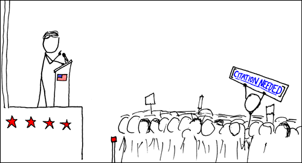

+++
title = "Zotero + Better BibTeX Setup Guide for Researchers"
date = "2026-05-11T12:15:26-07:00"
lastmod = "2026-05-29T20:45:00-07:00"
draft = false
+++



After years of using JabRef, I recently switched to Zotero and found it significantly more useful for managing a research library. Zotero manages papers, PDFs, notes, tags, and bibliographies in one place, while Better BibTeX provides excellent BibTeX support for LaTeX users.

## 1. Install Zotero

Download Zotero:

https://www.zotero.org/

Create a free Zotero account if you want cloud syncing between devices.

---

## 2. Install the Browser Connector

Install the Zotero Connector for your browser:

https://www.zotero.org/download/connectors

The connector allows one-click importing of papers from:

* arXiv
* ADS
* INSPIRE
* Springer
* APS journals
* IOP journals
* ACM
* IEEE
* Most publisher websites

### Typical Workflow

1. Open a paper webpage.
2. Click the Zotero icon in the browser toolbar.
3. Zotero imports:

   * citation metadata
   * DOI
   * abstract
   * PDF (when available)

On search result pages, Zotero often displays a folder icon, allowing you to import multiple papers at once.

---

## 3. Install Better BibTeX

Download:

https://github.com/retorquere/zotero-better-bibtex/releases

Install:

1. Open Zotero.
2. Tools → Plugins.
3. Click the gear icon.
4. Install Plugin From File.
5. Select the downloaded `.xpi`.
6. Restart Zotero.

Verify installation by checking for a "Better BibTeX" tab in Zotero settings.

---

## 4. Configure Citation Keys

Better BibTeX generates citation keys automatically.

A good default is:

```text
auth.lower + shorttitle(3, 3) + year
```

Examples:

```text
einsteinRelSpe1905
abbottObsGra2016
cainLikBasOne2026
```

Enable citation key pinning so keys do not change later when metadata is updated.

---

## 5. Collections vs Tags

The biggest mistake new users make is treating Zotero like a filesystem.

### Collections

Collections organize papers by topic.

Examples:

```text
Gravitational Waves
├── LIGO
├── LISA

Machine Learning
├── Representation Learning
├── Autoencoders
├── Anomaly Detection

Security

Teaching
```

Unlike folders, a paper can belong to multiple collections.

Example:

```text
LISA likelihood paper
  ↳ LISA
  ↳ Representation Learning
  ↳ Anomaly Detection
```

The paper exists only once in Zotero.

Collections answer:

> What is this paper about?

---

### Tags

Use tags for workflow, not topics.

Recommended tags:

```text
to-read
reading
important
cited
my-work
idea
```

Tags answer:

> What should I do with this paper?

Examples:

* `to-read`
* `important`
* `cited`
* `my-work`

Avoid creating dozens of subject tags that duplicate collections.

---

## 6. Suggested Library Structure

```text
Reading Queue

Gravitational Waves
├── LIGO
├── LISA

Machine Learning
├── Representation Learning
├── Autoencoders
├── Anomaly Detection

Security

Teaching
```

Keep the structure simple initially.

You can always reorganize later.

---

## 7. Disable Automatic Subject Tags

Many sources (especially arXiv) automatically import subject tags.

Examples:

```text
Cryptography and Security
FOS: Computer and Information Sciences
```

These can quickly clutter a library.

Consider disabling automatic subject tagging:

Settings → General → Miscellaneous

and rely on your own tags instead.

---

## 8. Published Papers vs arXiv Papers

For published papers, prefer:

* Metadata from the journal article
* PDF from arXiv (if needed)

Example:

```text
Journal Metadata:
  Classical and Quantum Gravity
  DOI
  Volume
  Pages

Attachment:
  arXiv PDF
```

This produces correct BibTeX entries while preserving open-access PDFs.

If you accidentally create separate journal and arXiv entries:

1. Keep the journal entry.
2. Attach the arXiv PDF to it.
3. Remove the duplicate bibliographic entry.

---

## 9. Exporting BibTeX

Better BibTeX can automatically maintain BibTeX files.

### Subject-Based Workflow

Create collections such as:

```text
Gravitational Waves
Machine Learning
Security
Teaching
```

Export each collection:

```text
gw.bib
ml.bib
security.bib
teaching.bib
```

Enable:

```text
Keep Updated
```

Whenever papers are added to a collection, the corresponding BibTeX file updates automatically.

### Why This Works

A manuscript can use:

```latex
\bibliography{gw,ml}
```

or

```latex
\addbibresource{gw.bib}
\addbibresource{ml.bib}
```

The bibliography files may contain hundreds of references; only cited references appear in the final document.

---

## 11. Recommended Workflow: Zotero + Better BibTeX + Git + Overleaf

For researchers who use Git and Overleaf, this is one of the cleanest workflows available.

The goal is simple:

```text
Zotero
   ↓
Better BibTeX
   ↓
references.bib (automatically maintained)
   ↓
Git Repository
   ↓
Overleaf
```

The bibliography becomes an automatically generated artifact rather than something you manually edit.

---

### Step 1: Create a Project Collection

Create a collection corresponding to your manuscript:

```text
Projects
├── LISA Likelihood Scoring
├── LISA Manifold Learning
├── Gauge Freedom
├── Telemetry Trust Maps
```

As you discover papers relevant to a manuscript, add them to the appropriate project collection.

A paper can belong to multiple collections without duplication.

---

### Step 2: Export a Collection Using Better BibTeX

Right-click the collection:

```text
Export Collection...
```

Select:

```text
Format: Better BibTeX
```

Enable:

```text
Keep Updated
```

Save the bibliography directly into your Git repository:

```text
paper/
├── manuscript.tex
├── references.bib
├── figures/
└── sections/
```

For example:

```text
~/repos/lisa-likelihood-paper/references.bib
```

Better BibTeX will now automatically update the file whenever papers are added, removed, or modified within that collection.

---

### Step 3: Commit the Bibliography to Git

Treat the bibliography like any other source file.

Example:

```bash
git add references.bib
git commit -m "Update bibliography"
git push
```

Because the file is generated automatically, you never need to edit it manually.

---

### Step 4: Connect Git and Overleaf

Overleaf supports Git integration.

Inside Overleaf:

```text
Menu → Git
```

Copy the Git URL.

Clone the Overleaf project:

```bash
git clone <overleaf-url>
```

or add it as a remote to an existing repository.

Example:

```bash
git remote add overleaf <overleaf-url>
```

Then:

```bash
git push overleaf main
```

Your manuscript and bibliography appear automatically in Overleaf.

---

### Step 5: Cite Normally in LaTeX

For BibTeX:

```latex
\bibliography{references}
```

For BibLaTeX:

```latex
\addbibresource{references.bib}
```

Then cite as usual:

```latex
\cite{cainLikBasOne2026}
```

The citation keys are generated automatically by Better BibTeX.

---
I use Overleaf at my job doing research in ML in cybersecurity, but for my work on Gravitational Waves I maintain a publications git repo where I use an editor -- one of the nice things, is that I can use my references directory in my git repo for publications for Overleaf syncing, having access to everything regardless of where I am writing the paper!

---
## 12. Using Zotero Across Multiple Computers

One of Zotero's biggest advantages over traditional BibTeX managers is that your research library can be synchronized across multiple machines.

Example:

```text
MacBook (work)
Linux Desktop (research)
Linux Laptop (travel)
```

All machines can share the same:

* Papers
* Collections
* Tags
* Notes
* Citation keys
* Attachments (optional)

---

### Step 1: Create a Zotero Account

Create a free account:

https://www.zotero.org/user/register

Then sign into Zotero on every machine:

```text
Settings → Sync
```

Enable:

```text
✓ Sync automatically
✓ Sync full-text content
```

Once synchronization completes, your collections, tags, notes, and metadata will appear on every device automatically.

---

### Step 2: Install Better BibTeX Everywhere

Better BibTeX is installed separately on each machine.

Install it wherever:

* MacBook
* Linux Desktop
* Linux Laptop
* Windows MiniPc

Your Zotero library will synchronize automatically, but Better BibTeX itself is a local plugin that must be installed on each computer.

After installation, verify:

* Citation key format
* Citation key pinning
* Automatic export settings

---

### Step 3: Understand What Syncs

#### Always Synced

```text
Papers
Collections
Subcollections
Tags
Notes
Annotations
Citation metadata
DOIs
Abstracts
```

#### Optional

```text
PDFs
Attachments
Supplementary files
```

PDF synchronization depends on your storage configuration.

---

### Option A: Zotero Cloud Storage (Simplest)

Use Zotero's hosted storage.

Advantages:

* Automatic
* No additional setup
* Works everywhere

Disadvantages:

* Large libraries may require a paid storage plan

For most researchers this is the easiest solution.

---

### Option B: Metadata Sync Only

Many researchers synchronize only:

```text
Collections
Tags
Notes
Metadata
```

while storing PDFs locally.

Advantages:

* No storage costs
* Fast synchronization

Disadvantages:

* PDFs are not automatically available on every machine

This works surprisingly well if your primary goal is citation management.

---

### Step 4: Keep Bibliographies in Git

Even if Zotero is synchronized, bibliography exports should still live inside the corresponding Git repository.

Example:

```text
lisa-likelihood-paper/
├── manuscript.tex
├── references.bib
└── figures/
```

Benefits:

* Overleaf receives bibliography updates automatically
* Collaborators get identical references
* Bibliography state is version controlled
* Papers remain reproducible

The Zotero library is your source of truth.

The exported `.bib` file is a generated artifact committed to the repository.

---

### Recommended Multi-System Setup

For a researcher working across multiple machines:

```text
Zotero Cloud Sync
        ↓
MacBook
Linux Desktop
Linux Laptop
        ↓
Better BibTeX
        ↓
references.bib
        ↓
Git Repository
        ↓
Overleaf
```

In practice:

1. Save a paper on any machine.
2. Zotero synchronizes it everywhere.
3. Add the paper to the relevant collection.
4. Better BibTeX updates the bibliography automatically.
5. Commit and push the repository.
6. Overleaf sees the updated bibliography.

The result is a single research library shared across all devices without manually copying PDFs, BibTeX files, or references between systems.

---

[← Back to Blog]()
